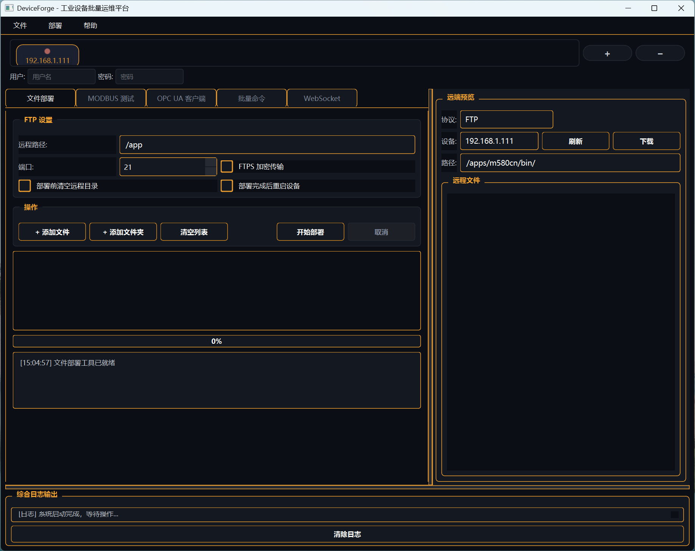
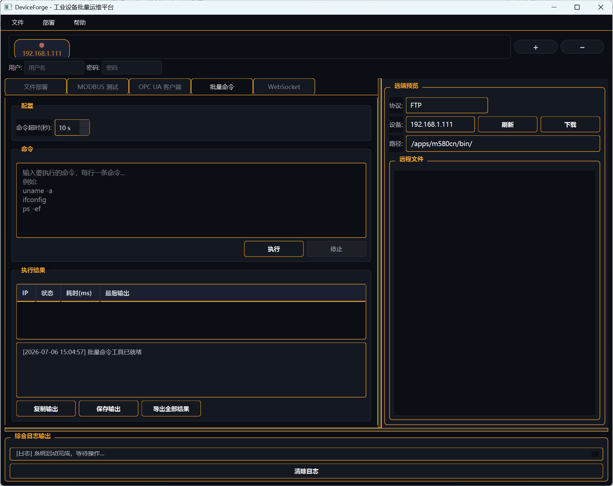
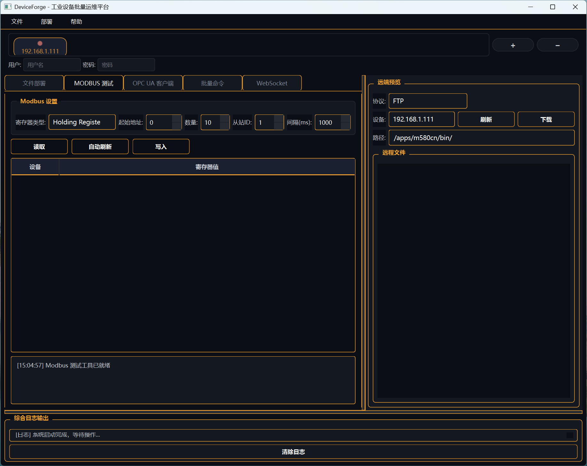
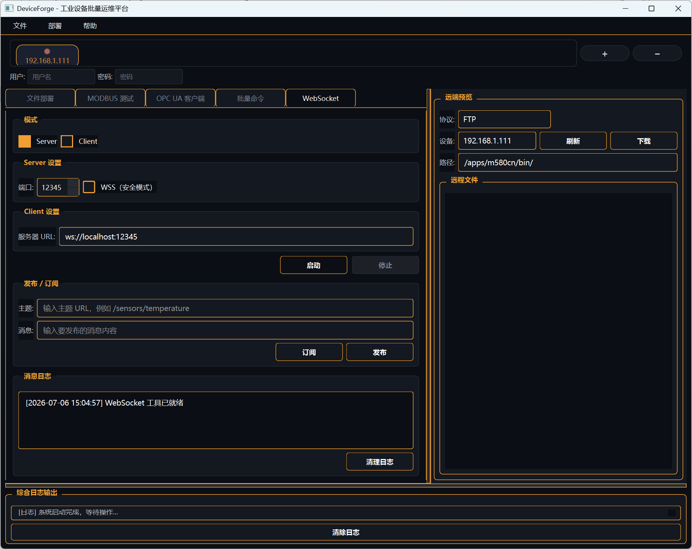
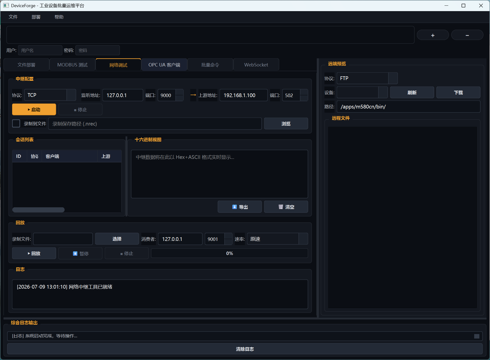
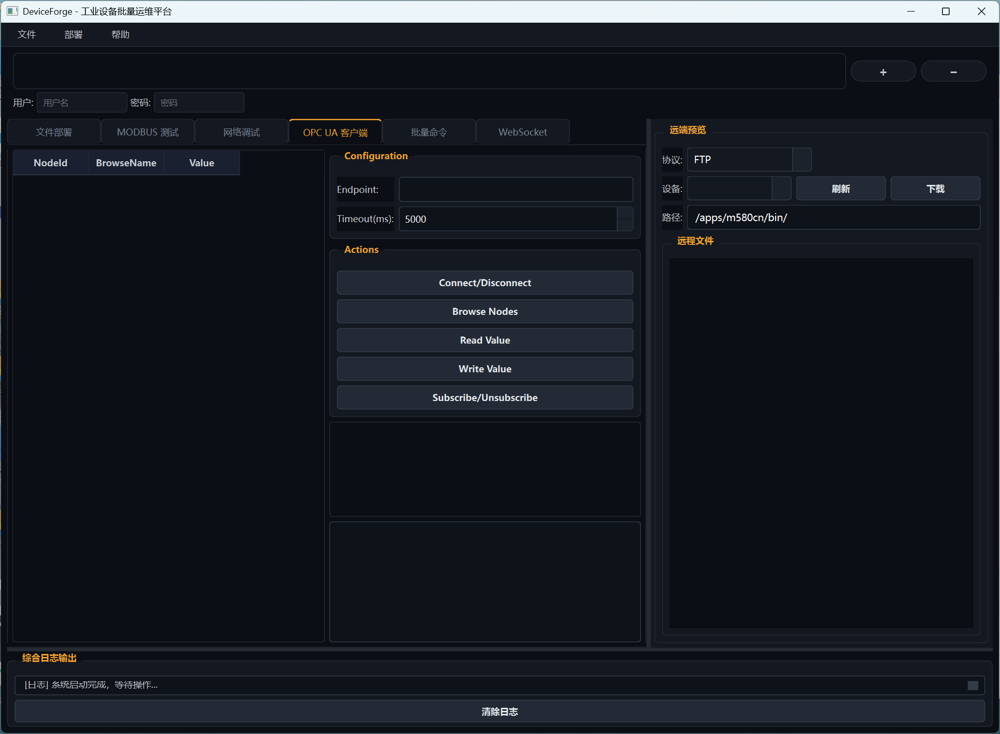

# DeviceForge — 工业设备批量运维平台

DeviceForge 是基于 Qt 6 + C++17 的工业级设备批量运维平台。2.0 版本引入插件化 Tool 架构和 Protocol Adapter 抽象层，从 SylixOS PLC 专用工具升级为面向通用工业设备（PLC、嵌入式终端、网络设备等）的可扩展运维平台。原名 DeployMaster，2026-07-05 更名为 DeviceForge。

**版本**：2.1.0 | **许可**：MIT License | **平台**：Windows（Linux 待适配）

---

## ✨ 2.0 新特性

| 特性 | 说明 |
|------|------|
| 🔌 **可扩展 Tool 架构** | Tool = Backend (ServiceTask) + Widget (QWidget)，新增功能无需修改主窗口 |
| 🔗 **Protocol Adapter 抽象** | 统一协议接口（FTP/Telnet/Modbus/SSH…），连接池 + 自动重连 |
| 🎨 **工业仪表盘主题** | 深色底 + 中性石墨结构，琴色仅标记可操作/活跃状态，输入凹陷·按钮凸起一眼可辨 |
| 📋 **设备总线** | 统一管理设备 IP+端口+凭证，替代旧式 IP 文本列表 |
| 📝 **结构化日志** | Qt → lwlog 管道桥接，支持控制台/文件/滚动归档 |
| 🔁 **网络中继 + 录制回放** | TCP/UDP 透明中继旁路抓包，流量录制为 `.nrec` 并按原始时序回放（2.1.0） |
| 🧩 **第三方组件集成** | lwserverbase / lwcommunicate / lwlog / lwmsgq / tinyxml2 / nanopb |

---

## 📸 界面截图

| 文件部署 | 批量命令 |
|----------|----------|
|  |  |

| MODBUS 测试 | WebSocket 通信 |
|-------------|---------------|
|  |  |

| 网络调试（中继 + 录制回放） | OPC UA 客户端 |
|------------------------------|---------------|
|  |  |

---

## 功能模块

| 模块 | 状态 | 协议 | 说明 |
|------|------|------|------|
| 文件部署 | ✅ Tool 架构 + FTPS | FTP/FTPS (libcurl) | 批量上传，支持 TLS 加密 |
| 批量命令执行 | ✅ Tool 架构 | Telnet (lwcommunicate) | 批量 Shell 命令，安全警告弹窗 |
| WebSocket 通信 | ✅ Tool 架构 | WebSocket | Server/Client，默认 localhost + 可选 Token 认证 |
| 远端文件浏览 | ✅ 含下载功能 | FTP (libcurl) | 远程目录浏览 + 文件下载 |
| Modbus 集群测试 | ✅ Tool 架构 | Modbus TCP | 批量读写寄存器，自动刷新 |
| 网络调试中继 | ✅ Tool 架构 | TCP/UDP/组播 透明代理 | 双向流量中继，Hex+ASCII 实时视图，数据导出，流量录制(.nrec)与按原始时序回放，组播录制与回灌 |
| OPC UA 客户端 | ⚠ 演示 | OPC UA | 硬编码演示数据，待实现 |

---

## 技术架构

### 双层架构（2.0）

```
Qt Shell (Widget)          Framework Layer           Adapter Layer
─────────────────          ─────────────────         ──────────────
DeviceBusWidget             ToolHost (桥接)          IProtocolAdapter
Tool Navigator              ToolRegistry (注册表)      ├─ FtpAdapter
QStackedWidget 工作区        ToolBackend (基类)         ├─ TelnetAdapter
darkstyle.qss 深色主题      ToolWidget (基类)          └─ ProtocolRegistry
      ↕                          ↕                         ↕
  lwmsgq 消息队列            ServiceManager            lwcommunicate
      ↕                          ↕                         ↕
  AppState                   ServiceTask               libcurl / QTcpSocket
```

**设计文档**：[架构设计](docs/superpowers/specs/2026-07-04-tool-framework-design.md) | [实施计划](docs/superpowers/plans/2026-07-04-tool-framework-plan.md)

### 第三方库

| 库 | 用途 |
|----|------|
| lwserverbase | 服务框架（ServiceTask 生命周期 / ConfigManager / MetricsCollector） |
| lwcommunicate | 网络通信库（TCP/UDP/Serial 连接池 + 指数退避自动重连） |
| lwlog | 管道式日志（Filter → Formatter → Appender，支持热加载配置） |
| lwmsgq | 线程安全消息队列（发布/订阅解耦） |
| lwcomm | 跨平台工具库（文件系统 / Base64 / 字符串 / 时间） |
| tinyxml2 | XML 解析（插件清单 manifest.xml） |
| nanopb | Protocol Buffers 编解码（消息序列化，待集成） |
| libcurl | FTP 文件传输 |

---

## 快速开始

### 预编译版（推荐）

从 [Releases](../../releases) 下载 `DeviceForge-v2.1.0-win64.zip`，解压后运行 `DeviceForge.exe`。

> 需要安装 [Visual C++ Redistributable](https://aka.ms/vs/17/release/vc_redist.x64.exe)（如已安装 VS2022 可跳过）。

### 从源码构建

```bash
mkdir build && cd build
cmake .. -DCMAKE_PREFIX_PATH="C:\Qt\6.10.1\msvc2022_64"
cmake --build . --config Release
```

### Visual Studio

直接打开 `DeployMaster.vcxproj`，需提前安装 Qt 6.10.1 + Qt Visual Studio Tools。

### CI

GitHub Actions（`.github/workflows/msbuild.yml`）：push/PR 到 `main` 时触发，Windows 环境，Qt 6.9.2，MSBuild。

---

## 系统要求

| 依赖 | 版本 |
|------|------|
| Qt | 6.10.1（Core/Gui/Widgets/Network/SerialBus/WebSockets） |
| MSVC | Visual Studio 2022 (v143) |
| CMake | 3.16+ |
| libcurl | 8.x（已内置 `lib/libcurl-x64.dll`） |
| 操作系统 | Windows 10/11 x64 |

---

## 项目结构

```
DeviceForge/
├── src/
│   ├── adapter/         # 协议适配器（FtpAdapter / TelnetAdapter / ProtocolRegistry）
│   ├── framework/       # 框架层（ToolBackend / ToolWidget / ToolHost / ToolRegistry）
│   ├── logging/         # LogBridge（Qt → lwlog）
│   ├── model/           # 旧业务模型（FtpManager，待迁移后移除）
│   ├── presenter/       # 旧 Presenter（FtpPresenter / ModbusPresenter，待移除）
│   ├── tools/           # Tool 实现（FtpDeployTool / ...）
│   ├── ui/              # UI 组件（DeviceBusWidget）
│   ├── utils/           # 工具类（DeployEvent，待移除）
│   └── thirdparty/      # 第三方库
├── docs/                # 文档目录
│   ├── *.md             # 对外交付文档（architecture / api-reference / user-guide / build-guide / security）
│   ├── images/          # 界面截图
│   └── superpowers/     # 设计规格（specs/）+ 实施计划（plans/）
├── include/curl/        # libcurl 头文件
├── lib/                 # libcurl 二进制文件
├── darkstyle.qss        # 工业仪表盘深色主题
├── DeployMaster.ui      # 主窗口布局
├── CMakeLists.txt       # CMake 构建
└── CLAUDE.md            # AI 助手指引
```

---

## 里程碑

| 版本 | 日期 | 内容 |
|------|------|------|
| **2.1.0** | 2026-07-09 | Modbus Tool 迁移 + NetRelayTool 网络调试中继（录制回放 .nrec）+ 首个单元测试目标 tst_nrec |
| 2.0.0 | 2026-07-04 | 插件化 Tool 架构 + Protocol Adapter 层 + 工业仪表盘主题 |
| 1.0.0 | 2026-06 | 7 模块功能完整，MVP+EventBus 架构（已废弃） |

[完整变更日志](CHANGELOG.md) · [发展路线图](ROADMAP.md)

---

## 注意事项

- 密码不持久化，每次启动需手动输入
- OPC UA 模块为演示模式，需引入 open62541 或 Qt OPC UA 模块实现
- VS 手动调试时需确保 `libcurl-x64.dll` 在输出目录（CMake 构建已自动处理）
