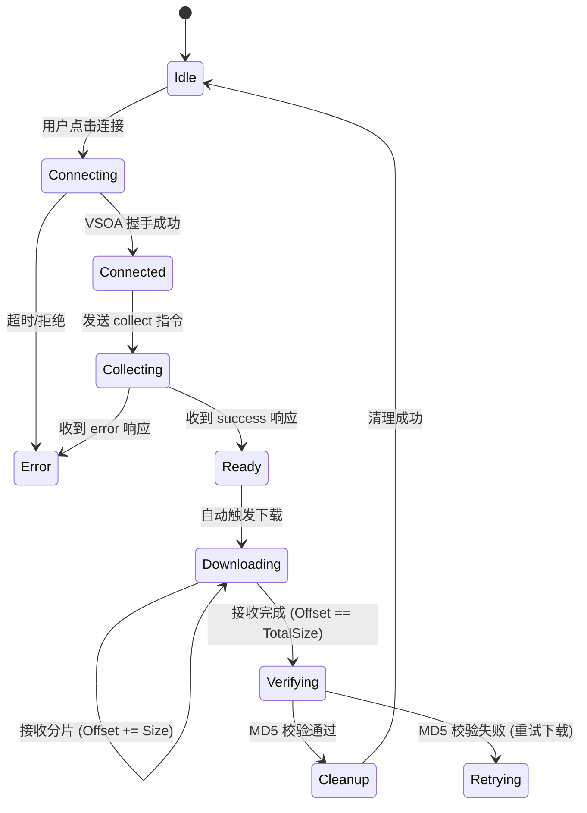

# Qt 上位机诊断工具 (PLC Diagnostic Client) 需求规格说明书 (PRD)

| 文档版本 | V1.0 |
| :--- | :--- |
| **项目名称** | PLC 远程诊断工具 (Qt Client) |
| **适用阶段** | 第一阶段：日志采集、文件传输与离线分析 |
| **通信协议** | 基于 VSOA (Vehicle Service-Oriented Architecture) |
| **开发框架** | Qt 6 (C++ / QML 或 Widgets) |
| **目标用户** | 现场维护工程师、系统研发工程师 |
| **最后更新** | 2026-02-27 |

---

## 1. 项目背景与目标

### 1.1 背景
针对 SylixOS PLC 系统出现的“双主冲突”等复杂故障，现场缺乏统一的诊断工具。目前需要人工登录多台设备逐个抓取日志，效率低且难以进行主备状态的时间同步对比分析。

### 1.2 目标
开发一款基于 Qt 的跨平台（Windows/Linux）桌面诊断工具。
*   **核心目标**：通过 VSOA 协议连接多台 PLC，一键触发日志采集，高效下载诊断包，并提供可视化的日志查看与主备状态对比分析功能。
*   **价值**：将故障定位时间从“小时级”缩短至“分钟级”，通过自动化对比快速发现主备不一致问题。

---

## 2. 用户角色与场景

| 角色 | 典型场景 | 核心诉求 |
| :--- | :--- | :--- |
| **现场维护工程师** | 故障发生后，携带笔记本到达现场，连接交换机。 | **快**：能快速搜索到 PLC IP，一键下载所有相关日志，无需敲命令。 |
| **系统研发工程师** | 在办公室分析现场回传的 `.diag` 包。 | **准**：能同时打开主备两个包，自动高亮差异，按时间轴对齐日志，快速定位“备机为何启动”。 |
| **测试工程师** | 进行冗余切换测试时。 | **稳**：能连续多次采集，自动保存历史版本，方便回溯测试过程。 |

---

## 3. 功能需求 (Functional Requirements)

### 3.1 设备连接与管理
*   **FR-02 连接状态监控**：
    *   自动尝试连接列表中的设备，并在 UI 上显示连接状态（在线/离线/认证失败）。
    *   支持手动刷新连接状态。
*   **FR-03 批量操作**：
    *   支持勾选多台设备，同时下发“采集指令”。

### 3.2 诊断任务执行
*   **FR-10 一键采集**：
    *   用户点击“开始诊断”，向选中设备发送 `/api/diag/collect` 请求。
    *   支持配置采集参数（如日志行数、是否包含 Dump 文件）。
    *   实时显示任务状态（等待中 -> 采集中 -> 就绪 -> 失败）。
*   **FR-11 进度可视化**：
    *   在采集过程中，显示 PLC 端返回的进度百分比（若服务端支持）或动画指示。
    *   若采集超时，自动报错并提示用户。

### 3.3 文件下载与管理
*   **FR-20 智能下载**：
    *   采集完成后，自动触发 `/api/diag/download` 流程。
    *   **断点续传**：若网络中断，重新连接后能从断开处继续下载，无需重新开始。
    *   **多线程/异步**：下载过程不阻塞 UI 界面，支持同时从多台设备下载。
*   **FR-21 本地存储管理**：
    *   自动创建本地目录结构：`./Logs/YYYY-MM-DD/DeviceName_Timestamp/`。
    *   下载完成后自动校验 MD5，确保文件完整性。
    *   支持手动清理本地历史日志文件。
*   **FR-22 远程清理**：
    *   下载并校验成功后，自动询问或配置为自动发送 `/api/diag/cleanup` 指令，清理 PLC 端临时文件。

### 3.4 日志分析与可视化 (核心亮点)
*   **FR-30 诊断包解析**：
    *   内置解压引擎，无需外部工具即可直接读取 `.diag` 包内容。
    *   自动识别包内的文件结构（proc.txt, ecs.json, dmesg.txt 等）。
*   **FR-31 多视图查看器**：
    *   **文件树视图**：左侧展示诊断包内的文件列表。
    *   **文本查看器**：右侧展示文件内容，支持大文件（>100MB）流畅加载。
    *   **关键字高亮**：自动高亮 `Error`, `Fail`, `Panic`, `Master`, `Standby`, `Running`, `Stopped` 等关键状态词。
*   **FR-32 主备对比模式 (Diff View)**：
    *   **双栏布局**：允许用户同时加载“主机”和“备机”的两个诊断包。
    *   **智能比对**：
        *   **进程/容器状态对比**：自动提取两机的进程表和容器状态，以表格形式并列展示，**高亮显示不一致的行**（例如：主机容器 Running，备机容器也 Running -> 红色报警）。
        *   **配置比对**：比对关键配置文件内容，显示差异行。
*   **FR-33 统一时间轴 (Timeline)**：
    *   从主备两机的日志中提取带时间戳的事件（如“心跳丢失”、“角色切换”、“容器启动”）。
    *   在一条公共时间轴上混合展示，帮助工程师分析事件发生的先后顺序（因果关系的判断依据）。

### 3.5 报告生成
*   **FR-40 诊断报告导出**：
    *   支持将当前的对比分析结果、关键日志片段导出为 HTML 或 PDF 报告。
    *   报告包含：设备基本信息、采集时间、发现的异常项（如双主状态）、关键日志截图。

---

## 4. 非功能需求 (Non-Functional Requirements)

| 指标 | 要求 | 备注 |
| :--- | :--- | :--- |
| **响应速度** | 界面操作无卡顿，大日志文件（50MB+）打开时间 < 3s | 需使用异步加载和虚拟列表技术 |
| **传输性能** | 单设备下载速度 > 80% 局域网理论带宽 | 充分利用 VSOA 分片传输 |
| **稳定性** | 支持连续下载 10+ 个设备不崩溃，无内存泄漏 | 重点测试文件流处理逻辑 |
| **兼容性** | 支持 Windows 10/11, Ubuntu 20.04+ | 适配现场可能的不同办公环境 |
| **易用性** | 无需安装额外依赖（如 tar, unzip），绿色免安装 | 静态编译或使用 Qt 自带库 |
| **安全性** | 敏感信息（密码）本地加密存储 | 使用 Qt QSettings 加密或密钥环 |

---

## 5. 界面交互设计 (UI/UX)

### 5.1 主界面布局
*   **顶部栏**：设备连接状态指示灯、全局操作按钮（连接、断开、批量采集）。
*   **左侧面板**：设备列表树（支持多选），显示设备 IP、名称、当前状态。
*   **中部面板**：
    *   **任务页**：显示当前采集/下载任务的进度条、速度、剩余时间。
    *   **分析页**：默认显示最近一次完成的诊断包分析结果。
*   **底部面板**：系统日志输出窗口（显示软件自身的运行日志，如“连接成功”、“下载完成”）。

### 5.2 对比分析界面 (Diff Mode)
*   **布局**：左右分栏，中间为差异统计概览。
*   **交互**：
    *   点击左侧“主机包”，右侧“备机包”。
    *   选择“容器状态对比”标签页 -> 表格自动渲染，异常行标红。
    *   点击某一行，下方显示该容器/进程的详细日志片段。
*   **时间轴视图**：
    *   横向滚动条，刻度为时间。
    *   不同颜色的标记点代表不同类型的事件（红色=错误，蓝色=状态切换，绿色=心跳）。
    *   鼠标悬停显示事件详情。

---

## 6. 技术架构设计

### 6.1 模块划分
1.  **VSOA 通信层 (`VsoaManager`)**：
    *   封装 VSOA C/C++ 库，提供 Qt 信号槽接口。
    *   负责连接管理、RPC 调用、二进制流接收与重组。
2.  **任务调度器 (`TaskScheduler`)**：
    *   管理并发下载任务队列。
    *   处理断点续传逻辑（记录本地已下载 offset）。
3.  **数据解析层 (`DiagParser`)**：
    *   负责 `.diag` 文件的解压（调用 `QZipReader` 或系统 `tar`）。
    *   解析 JSON/XML/Txt 日志，提取结构化数据（用于对比）。
4.  **UI 展示层 (`QML/Widgets`)**：
    *   负责数据绑定、图表绘制（QChart）、文本高亮（QSyntaxHighlighter）。

### 6.2 关键技术点
*   **大文件处理**：使用 `QFile` 流式读写，严禁将整个日志文件加载到 `QString` 或内存中。
*   **异步 IO**：所有网络请求和文件 IO 必须在子线程 (`QThread` 或 `QtConcurrent`) 中执行。
*   **自定义协议解析**：编写专门的类处理 VSOA 的 `Data` 字段拼接，确保二进制文件完整无误。

---

## 7. 数据流与状态机

### 7.1 下载状态机


### 7.2 数据存储结构
本地文件系统结构示例：
```text
/DiagnosticLogs/
  ├── 2026-02-27/
  │     ├── PLC_Master_01/
  │     │     ├── diag_20260227_145000.diag (原始包)
  │     │     └── extracted/ (解压目录)
  │     │           ├── proc.txt
  │     │           ├── ecs.json
  │     │           └── ...
  │     └── PLC_Standby_02/
  │           └── ...
  └── config.ini (设备列表)
```

---

## 8. 实施路线图 (Roadmap)

### Phase 1: 基础框架与通信 (Week 1-2)
*   [ ] 搭建 Qt 工程，集成 VSOA SDK。
*   [ ] 实现设备列表管理与连接功能。
*   [ ] 打通 `/api/diag/collect` 和 `/api/diag/download` 流程，实现单文件下载保存到本地。

### Phase 2: 核心功能完善 (Week 3-4)
*   [ ] 实现断点续传逻辑。
*   [ ] 实现 `.diag` 包的自动解压与文件浏览功能。
*   [ ] 开发日志文本查看器（支持高亮、搜索）。

### Phase 3: 高级分析与对比 (Week 5-6)
*   [ ] 开发“主备对比”模块（进程表对比、容器状态对比）。
*   [ ] 开发“统一时间轴”视图，解析多源日志时间戳。
*   [ ] 实现异常自动检测算法（如双主状态识别）。

### Phase 4: 优化与发布 (Week 7)
*   [ ] UI 美化与交互优化。
*   [ ] 压力测试（大文件、多设备并发）。
*   [ ] 打包发布（Windows exe / Linux AppImage）。

---
\