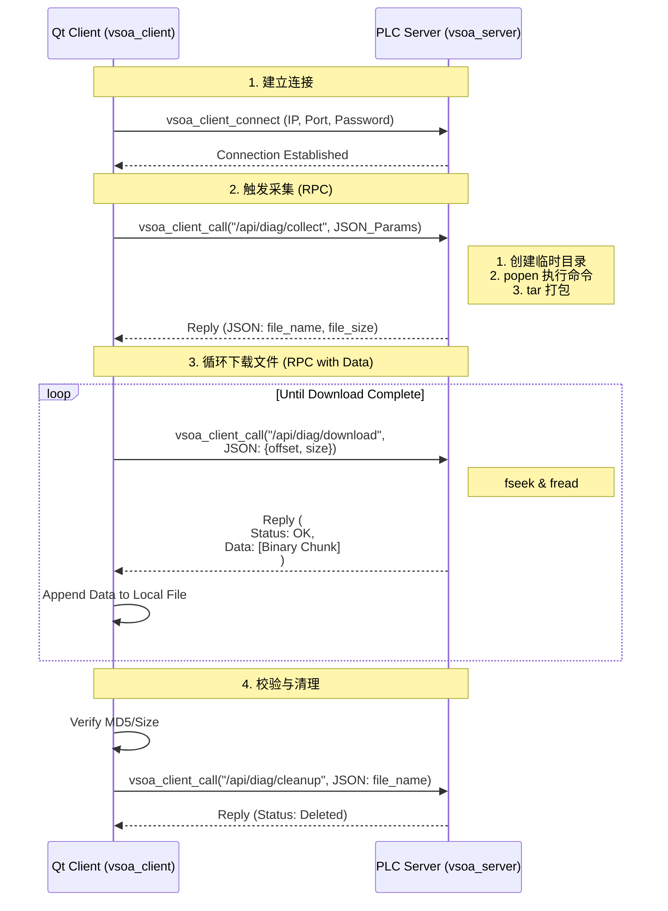

基于您提供的 **VSOA (Vehicle Service-Oriented Architecture)** 协议规范，我们可以将其作为底层传输框架，设计一套专用于 **Qt 诊断工具与 SylixOS PLC** 交互的应用层协议。

### 设计思路
1.  **复用 VSOA 头部**：直接使用 VSOA 的 20 字节标准头部，确保兼容现有的 VSOA 库（`libvsoa`）。
2.  **URL 路由设计**：利用 VSOA 的 URL 机制定义诊断服务的接口路径（如 `/api/diag/collect`）。
3.  **通信模式选择**：
    *   **控制指令**（采集、清理）：使用 **RPC 模式** (`RemoteCall`)，保证指令必达且有明确结果。
    *   **大文件传输**（日志包）：使用 **Stream 模式** 或 **RPC + Data 字段**。考虑到 VSOA 支持 `Data Length` 字段，我们可以将二进制文件直接放在 `Data` 负载中，通过分片 RPC 或专用数据报传输。为了可靠性，建议第一阶段使用 **RPC 携带 Data 负载** 的方式传输文件片段。
4.  **负载格式**：
    *   **Parameter**：存放 JSON 控制参数（如文件名、偏移量）。
    *   **Data**：存放二进制文件流。

---

# 基于 VSOA 的 PLC 诊断应用层协议规约 (v1.0)

## 1. 基础配置
*   **传输层**: TCP (默认端口由 VSOA 服务器配置，例如 8899)
*   **协议版本**: VSOA Ver 0x2
*   **Magic**: 0x9
*   **认证**: 建议开启 VSOA 密码认证 (`vsoa_server_passwd`)，防止未授权访问。

## 2. URL 路径定义 (Resource ID)
所有诊断服务均挂载在 `/api/diag/` 根路径下。

| 功能 | URL 路径 | 方法类型 | 描述 |
| :--- | :--- | :--- | :--- |
| **采集日志** | `/api/diag/collect` | RPC (Request/Reply) | 触发 PLC 执行采集脚本并打包 |
| **下载文件** | `/api/diag/download` | RPC (Request/Reply) | 请求文件的指定片段 (支持断点续传) |
| **清理文件** | `/api/diag/cleanup` | RPC (Request/Reply) | 删除 PLC 端的临时诊断文件 |
| **状态查询** | `/api/diag/status` | RPC (Request/Reply) | 查询当前是否有任务正在运行/文件是否就绪 |
| **心跳检测** | `/api/diag/ping` | RPC 或 Ping/Echo | 链路保活 |

## 3. 消息详细定义

### 3.1 采集日志 (`/api/diag/collect`)
*   **方向**: Qt Client -> PLC Server
*   **VSOA Header**:
    *   `TYPE`: `0x01` (RemoteCall)
    *   `R`: 0 (Request)
    *   `Sequence Number`: 递增序列号
    *   `Resource ID`: `/api/diag/collect`
    *   `Parameter Length`: JSON 长度
    *   `Data Length`: 0
*   **Parameter (JSON)**:
    ```json
    {
      "log_lines": 500,       // 每个日志文件最大行数
      "include_dump": false,  // 是否包含 Core Dump
      "timeout_sec": 60       // 采集超时时间
    }
    ```
*   **Response (PLC -> Qt)**:
    *   `TYPE`: `0x01` (RemoteCall)
    *   `R`: 1 (Reply)
    *   `Status Code`: 0 (Success) 或 错误码
    *   **Parameter (JSON)**:
        ```json
        {
          "status": "success",
          "file_name": "diag_20260227_145000.diag",
          "file_size": 1048576,
          "md5": "a1b2c3d4..." 
        }
        ```

### 3.2 下载文件片段 (`/api/diag/download`)
*   **方向**: Qt Client -> PLC Server
*   **VSOA Header**:
    *   `TYPE`: `0x01` (RemoteCall)
    *   `R`: 0 (Request)
    *   `Resource ID`: `/api/diag/download`
    *   `Parameter Length`: JSON 长度
    *   `Data Length`: 0 (请求包不带数据)
*   **Parameter (JSON)**:
    ```json
    {
      "file_name": "diag_20260227_145000.diag",
      "offset": 0,            // 起始字节偏移
      "size": 4096            // 请求读取的字节数
    }
    ```
*   **Response (PLC -> Qt)**:
    *   **关键点**: 文件二进制数据放在 **Data** 字段中，而不是 Parameter。
    *   `TYPE`: `0x01` (RemoteCall)
    *   `R`: 1 (Reply)
    *   `Status Code`: 0 (Success)
    *   `Parameter Length`: 0 (或包含少量元数据的 JSON，如实际读取长度)
    *   `Data Length`: 实际读取的字节数 (N)
    *   **Data Payload**: `[Binary File Content]` (N 字节)
    *   *注：若 VSOA 库限制单次 Data 大小，需在应用层循环调用此接口，每次增加 offset。*

### 3.3 清理文件 (`/api/diag/cleanup`)
*   **方向**: Qt Client -> PLC Server
*   **VSOA Header**:
    *   `TYPE`: `0x01` (RemoteCall)
    *   `R`: 0 (Request)
    *   `Resource ID`: `/api/diag/cleanup`
*   **Parameter (JSON)**:
    ```json
    {
      "file_name": "diag_20260227_145000.diag"
    }
    ```
*   **Response (PLC -> Qt)**:
    *   `Status Code`: 0 (Success)
    *   **Parameter (JSON)**: `{"status": "deleted"}`

### 3.4 状态查询 (`/api/diag/status`)
*   **方向**: Qt Client -> PLC Server
*   **用途**: 在采集耗时较长时，客户端可轮询此接口查看进度，或确认文件是否已生成。
*   **Response (PLC -> Qt)**:
    *   **Parameter (JSON)**:
        ```json
        {
          "state": "idle", // idle, collecting, ready, error
          "progress": 0,   // 0-100%
          "current_file": "",
          "error_msg": ""
        }
        ```

---

## 4. 通信流程设计 (基于 VSOA API)

### 4.1 采集与下载完整流程



### 4.2 关键实现细节 (C/C++ VSOA API)

#### 服务端 (PLC) 监听器注册
```cpp
// 1. 注册采集接口
vsoa_server_add_listener(server, "/api/diag/collect", on_collect_handler, NULL);

// 2. 注册下载接口
vsoa_server_add_listener(server, "/api/diag/download", on_download_handler, NULL);

// 3. 注册清理接口
vsoa_server_add_listener(server, "/api/diag/cleanup", on_cleanup_handler, NULL);

// 回调函数示例：on_download_handler
void on_download_handler(VsoaServer* server, VsoaClient* client, 
                         const char* url, const void* param, size_t param_len,
                         const void* data, size_t data_len) {
    // 1. 解析 param (JSON) 获取 filename, offset, size
    JsonRequest req = parse_json(param);
    
    // 2. 打开文件，seek 到 offset
    FILE* fp = fopen(req.filename, "rb");
    fseek(fp, req.offset, SEEK_SET);
    
    // 3. 读取数据到 buffer
    char buffer[4096];
    size_t read_bytes = fread(buffer, 1, req.size, fp);
    fclose(fp);
    
    // 4. 构造回复 (Parameter 为空或含元数据，Data 为文件内容)
    JsonResponse rsp; 
    rsp.status = "ok";
    
    // 调用 VSOA 回复接口，注意 Data 指针指向二进制内容
    vsoa_server_cli_reply(server, client, 0, // Status Code 0
                          rsp.to_string().c_str(), rsp.to_string().length(),
                          buffer, read_bytes); 
}
```

#### 客户端 (Qt) 调用逻辑
```cpp
// 使用同步调用简化逻辑，或使用异步回调
// 下载片段
QByteArray params = createJson({{"offset", offset}, {"size", 4096}});
void* responseData = nullptr;
size_t responseLen = 0;
void* binaryData = nullptr;
size_t binaryLen = 0;

int status = vsoa_client_sync_call(client, "/api/diag/download", 
                                   params.data(), params.size(),
                                   &responseData, &responseLen,
                                   &binaryData, &binaryLen);

if (status == 0) {
    // 将 binaryData 写入本地文件
    localFile.write((const char*)binaryData, binaryLen);
    // 释放 VSOA 分配的内存
    free(binaryData); 
    free(responseData);
}
```

---

## 5. 错误码映射 (VSOA Status Code)
利用 VSOA 头部的 4 位 `Status Code` 字段快速判断结果，详细错误信息放在 JSON Parameter 中。

| Status Code | 含义 | 对应业务场景 |
| :--- | :--- | :--- |
| `0` | **Success** | 操作成功 |
| `1` | **Bad Request** | JSON 格式错误，参数缺失 |
| `2` | **Not Found** | 文件不存在，URL 路径错误 |
| `3` | **Busy** | 正有其他采集任务在运行 |
| `4` | **Internal Error** | 命令执行失败，磁盘满，打包失败 |
| `5` | **Timeout** | 采集超时 |

---

## 6. 优势分析
1.  **标准化**: 完全遵循 VSOA 规范，可直接利用翼辉或第三方提供的成熟 VSOA 库，无需重复造轮子处理粘包、心跳、重连等底层问题。
2.  **高效性**: 利用 VSOA 的 `Data` 字段直接传输二进制，避免了 Base64 编码带来的 33% 体积膨胀和 CPU 消耗。
3.  **扩展性**: 未来若需增加“实时订阅容器状态”功能，可直接使用 VSOA 的 `Subscribe`/`Publish` 模式 (`/sta/ecs/*`)，无需修改底层协议。
4.  **安全性**: 直接继承 VSOA 的密码认证和潜在的 TLS 加密支持。

## 7. 实施注意事项
1.  **大包限制**: VSOA 默认最大包长度为 256KB。如果 `file_size` 单次请求超过此限制，**必须**在应用层进行分片（如每次请求 32KB），并在 Qt 端组装。
2.  **内存管理**: 在 SylixOS 端，`vsoa_server_cli_reply` 可能会复制数据。确保发送大文件分片时，buffer 是栈分配或静态分配，且在回调返回前有效。
3.  **URL 匹配**: 确保注册 Listener 时 URL 路径严格匹配，注意末尾斜杠 `/` 的区别（参考 VSOA 文档 6.2 节）。建议使用精确匹配 `/api/diag/collect`。

这套方案将您的诊断业务逻辑完美映射到了 VSOA 的服务架构上，既利用了现有库的能力，又满足了文件传输的特殊需求。