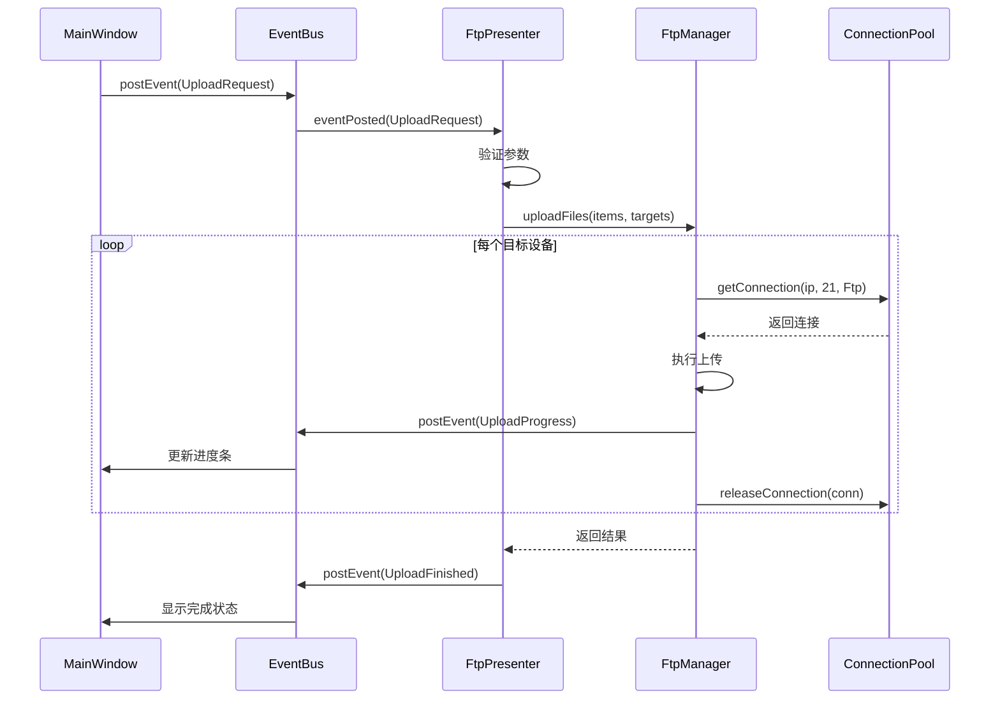
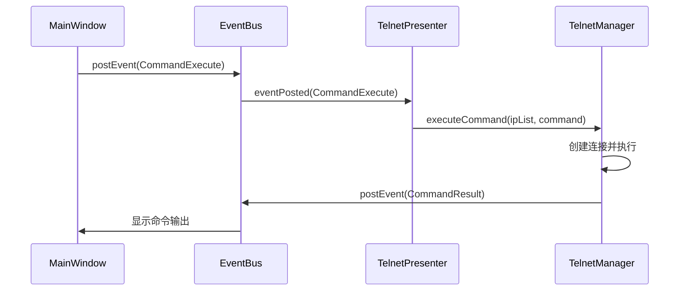
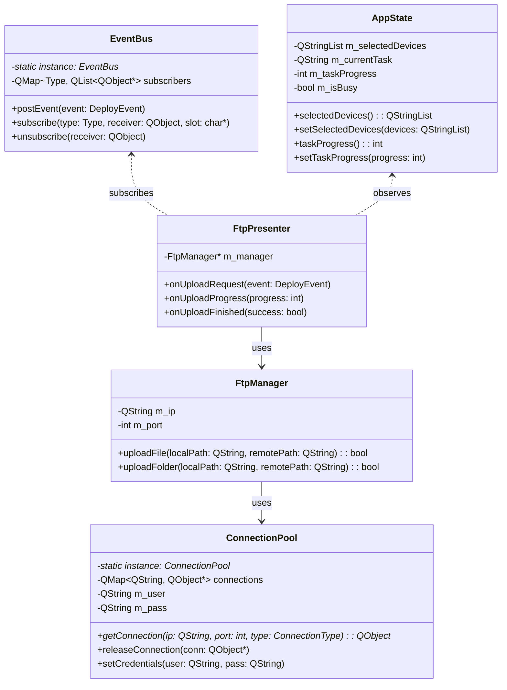

# DeployMaster 重构设计文档

| 文档版本 | V1.0 |
| :--- | :--- |
| **项目名称** | DeployMaster 架构重构 |
| **适用阶段** | Phase 1-2：基础框架搭建与核心模块重构 |
| **最后更新** | 2026-06-14 |

---

## 1. 现状分析

### 1.1 当前架构问题

| 问题类别 | 具体问题 | 影响 |
| :--- | :--- | :--- |
| **耦合度** | 业务逻辑直接操作 UI 控件 | 难以测试，维护困难 |
| **线程安全** | `QtConcurrent::run` 中 UI 更新模式不一致 | 潜在崩溃风险 |
| **代码重复** | FTP/Telnet 连接、认证逻辑重复 | 维护成本高 |
| **扩展性** | 新增协议需大幅修改主窗口 | 迭代效率低 |
| **状态管理** | 各模块状态分散 | 状态同步困难 |

### 1.2 核心模块现状

| 模块 | 文件 | 状态 |
|------|------|------|
| FTP 部署 | `FtpManager.cpp/h` | ✅ 完整 |
| Telnet 部署 | `TelnetClient.cpp/h`, `TelnetDeploy.cpp/h` | ✅ 完整 |
| Modbus 测试 | `ModbusCluster.cpp/h` | ✅ 完整 |
| OPC UA | `OpcUaClient.cpp/h` | ⚠️ 占位 |
| WebSocket | `WebSocketClient.cpp/h` | ⚠️ 占位 |

---

## 2. 重构目标

### 2.1 架构目标

1. **解耦**：UI 层与业务逻辑完全分离
2. **可测试**：核心业务逻辑可独立单元测试
3. **可扩展**：新增协议模块无需修改主窗口
4. **可维护**：统一的代码风格和设计模式

### 2.2 非功能目标

| 指标 | 要求 |
|------|------|
| 响应速度 | UI 操作无卡顿 |
| 稳定性 | 连续操作无内存泄漏 |
| 兼容性 | 兼容现有功能和配置 |

---

## 3. 架构设计

### 3.1 架构风格：MVP + 事件总线

```
┌──────────────────────────────────────────────────────────────────┐
│                         UI Layer (View)                         │
│  ┌───────────────────────────────────────────────────────────┐   │
│  │  MainWindow ────────────────────────────────────────────  │   │
│  │  ┌─────────────────────────────────────────────────────┐  │   │
│  │  │  TabWidget (FTP/Telnet/Modbus/...)                  │  │   │
│  │  │  StatusBar + ToolBar                                │  │   │
│  │  └──────────────────────┬──────────────────────────────┘  │   │
│  │                         │ signals                        │   │
│  └─────────────────────────┼─────────────────────────────────┘   │
│                           ↓                                      │
│         ┌──────────────────────────────────────────────┐          │
│         │            EventBus (事件总线)                │          │
│         │  ┌────────────────────────────────────────┐  │          │
│         │  │ postEvent() ←──→ eventPosted() signal  │  │          │
│         │  └────────────────────────────────────────┘  │          │
│         └────────────────┬─────────────────────────────┘          │
│                          │ subscribe / post                       │
├──────────────────────────┼──────────────────────────────────────┤
│                  Presenter Layer                               │
│  ┌─────────────┐  ┌─────────────┐  ┌─────────────────┐          │
│  │ FtpPresenter│  │ TelPresenter│  │ ModbusPresenter │          │
│  │ (UI 逻辑)   │  │ (UI 逻辑)   │  │ (UI 逻辑)       │          │
│  └──────┬──────┘  └──────┬──────┘  └────────┬────────┘          │
│         │                │                   │                   │
│         └────────────────┼───────────────────┘                   │
│                          ↓                                      │
├──────────────────────────┼──────────────────────────────────────┤
│                      Model Layer                                │
│  ┌─────────────┐  ┌─────────────┐  ┌─────────────────┐          │
│  │ FtpManager  │  │ TelnetMgr   │  │ ModbusCluster   │          │
│  │ (业务逻辑)  │  │ (业务逻辑)  │  │ (业务逻辑)      │          │
│  └──────┬──────┘  └──────┬──────┘  └────────┬────────┘          │
│         │                │                   │                   │
│         └────────────────┼───────────────────┘                   │
│                          ↓                                      │
│                   ┌─────────────┐                               │
│                   │ ConnectionPool ← 连接复用池                  │
│                   └─────────────┘                               │
└──────────────────────────────────────────────────────────────────┘
```

### 3.2 核心组件设计

#### 3.2.1 EventBus（事件总线）

**功能**：统一事件分发，解耦模块间通信

**类设计**：

| 方法 | 功能 | 参数 | 返回值 |
|------|------|------|--------|
| `postEvent()` | 发布事件 | `const DeployEvent& event` | `void` |
| `subscribe()` | 订阅事件类型 | `DeployEvent::Type type, QObject* receiver, const char* slot` | `void` |
| `unsubscribe()` | 取消订阅 | `QObject* receiver` | `void` |

**事件类型定义**：

```cpp
class DeployEvent {
public:
    enum Type {
        ConnectionStatusChanged,  // 连接状态变化
        TaskStarted,              // 任务开始
        TaskProgress,             // 任务进度
        TaskFinished,             // 任务完成
        ErrorOccurred,            // 错误发生
        LogMessage,               // 日志消息
        UploadRequest,            // 上传请求（新增）
        CommandExecute            // 命令执行请求（新增）
    };
    
    Type type;
    QVariant data;
    QString senderId;
};
```

#### 3.2.2 ConnectionPool（连接池）

**功能**：复用网络连接，统一认证管理

**类设计**：

| 方法 | 功能 | 参数 | 返回值 |
|------|------|------|--------|
| `getConnection()` | 获取连接 | `const QString& ip, int port, ConnectionType type` | `QObject*` |
| `releaseConnection()` | 释放连接 | `QObject* connection` | `void` |
| `setCredentials()` | 设置全局凭证 | `const QString& user, const QString& pass` | `void` |
| `getStatus()` | 获取连接状态 | `const QString& ip` | `ConnectionStatus` |

#### 3.2.3 AppState（应用状态）

**功能**：全局状态管理

**状态字段**：

| 字段 | 类型 | 说明 |
|------|------|------|
| `selectedDevices` | `QStringList` | 当前选中的设备列表 |
| `currentTask` | `QString` | 当前执行的任务名称 |
| `taskProgress` | `int` | 任务进度 (0-100) |
| `isBusy` | `bool` | 是否正在执行任务 |
| `lastError` | `QString` | 最后一次错误信息 |

---

## 4. 模块重构设计

### 4.1 FTP 模块重构

**重构前**：`FtpManager` 直接被 `DeployMaster` 调用

**重构后**：

```
DeployMaster ──(EventBus)──→ FtpPresenter ──→ FtpManager
     ↑                              │
     └────────(EventBus)←───────────┘
```

**FtpPresenter 职责**：
- 监听 UI 事件（上传按钮点击等）
- 调用 `FtpManager` 执行实际操作
- 接收 `FtpManager` 状态变化，通过 `EventBus` 通知 UI
- 管理 FTP 任务队列

### 4.2 Telnet 模块重构

**重构前**：`TelnetClient` 直接在 `DeployMaster` 中创建和使用

**重构后**：

```
DeployMaster ──(EventBus)──→ TelnetPresenter ──→ TelnetManager
     ↑                                 │
     └──────────(EventBus)←────────────┘
```

**TelnetManager 职责**：
- 管理多个 Telnet 连接
- 批量执行命令
- 处理连接超时和重连

### 4.3 连接池集成（架构偏离说明 ⚠️）

> **注意**：实际实现中 FtpManager **未使用** ConnectionPool。设计文档原要求通过 `ConnectionPool::instance()->getConnection()` 获取 FTP 连接，但实际代码中 FtpManager 每个操作独立创建 `CURL*` 句柄进行 FTP 通信。ConnectionPool 目前为预留框架，待后续版本集成。

原设计（待实现）：

```cpp
// FtpManager 使用连接池（长期目标）
class FtpManager {
public:
    bool uploadFile(const QString& localPath, const QString& remotePath) {
        auto conn = ConnectionPool::instance()->getConnection(m_ip, 21, ConnectionType::Ftp);
        if (!conn) return false;
        // 使用连接上传文件...
        ConnectionPool::instance()->releaseConnection(conn);
        return true;
    }
};
```

当前实现：FtpManager 直接管理 libcurl CURL* 句柄，每个上传/列表/下载操作独立创建和销毁连接。
```

---

## 5. 数据流设计

### 5.1 文件上传流程



### 5.2 命令执行流程



---

## 6. 实施路线图

### Phase 1: 基础框架搭建（第1周）

| 任务 | 描述 | 状态 |
|------|------|------|
| T1-01 | 创建 EventBus 单例类 | ✅ 已完成 (2026-06) |
| T1-02 | 创建 ConnectionPool 类 | ✅ 已完成 (2026-06) |
| T1-03 | 创建 AppState 类 | ✅ 已完成 (2026-06) |
| T1-04 | 定义事件类型枚举 | ✅ 已完成（含新增 UploadRequest、CommandExecute） |

### Phase 2: FTP 模块重构（第2周）

| 任务 | 描述 | 状态 |
|------|------|------|
| T2-01 | 创建 FtpPresenter 类 | ✅ 已完成（需在 main.cpp 中实例化） |
| T2-02 | 修改 FtpManager 依赖注入 / 迁移到 src/model/ | ✅ 已完成（旧根目录文件已删除） |
| T2-03 | 更新 MainWindow 使用事件总线 | ✅ 已完成（部署流程迁移至 EventBus） |
| T2-04 | 添加单元测试 | ❌ 未实现 |

### Phase 3: Telnet/Modbus 模块重构（第3周）

| 任务 | 描述 | 状态 |
|------|------|------|
| T3-01 | 创建 TelnetPresenter/TelnetManager | ❌ 未实现（仍使用旧 TelnetDeploy 架构） |
| T3-02 | 创建 ModbusPresenter | ⚠️ 空壳（构造函数不订阅事件，onEventPosted 为空） |
| T3-03 | 更新相关 UI 绑定 | ❌ 未实现 |
| T3-04 | 添加单元测试 | ❌ 未实现 |

### Phase 4: 完善与测试（第4周）

| 任务 | 描述 | 状态 |
|------|------|------|
| T4-01 | 完善日志系统 | ❌ 未实现 |
| T4-02 | 添加异常处理 | ⚠️ 部分实现 |
| T4-03 | 性能测试 | ❌ 未实现 |
| T4-04 | 文档更新 | ⚠️ 已于 2026-06-30 更新 |

---

## 7. 代码规范

### 7.1 命名规范

| 类型 | 规则 | 示例 |
|------|------|------|
| 类名 | PascalCase | `FtpPresenter` |
| 方法名 | camelCase | `uploadFiles()` |
| 成员变量 | m_camelCase | `m_taskQueue` |
| 常量 | UPPER_SNAKE_CASE | `MAX_RETRY_COUNT` |

### 7.2 设计模式应用

| 模式 | 应用场景 |
|------|----------|
| 单例模式 | EventBus, ConnectionPool, AppState |
| 观察者模式 | EventBus 事件订阅 |
| 策略模式 | 不同协议的连接处理 |
| 工厂模式 | 连接创建 |

---

## 8. 测试策略

### 8.1 单元测试

- 测试 `EventBus` 的事件发布/订阅机制
- 测试 `ConnectionPool` 的连接复用逻辑
- 测试各 Presenter 的业务逻辑

### 8.2 集成测试

- FTP 上传流程端到端测试
- Telnet 命令执行流程测试
- 多设备并发操作测试

### 8.3 性能测试

- 10+ 设备并发上传测试
- 大文件（50MB+）上传测试
- 长时间运行稳定性测试

---

## 9. 迁移策略

### 9.1 渐进式迁移

1. **第一阶段**：引入 EventBus，新功能使用事件驱动
2. **第二阶段**：逐步将现有模块迁移到 Presenter 模式
3. **第三阶段**：移除旧的直接调用方式

### 9.2 兼容性保障

- 保持现有 API 兼容性（通过适配器模式）
- 配置文件向后兼容
- 数据存储格式不变

---

## 附录：类依赖关系



---

**设计文档完成**。接下来我会进行自我审查，然后请你确认是否需要调整。